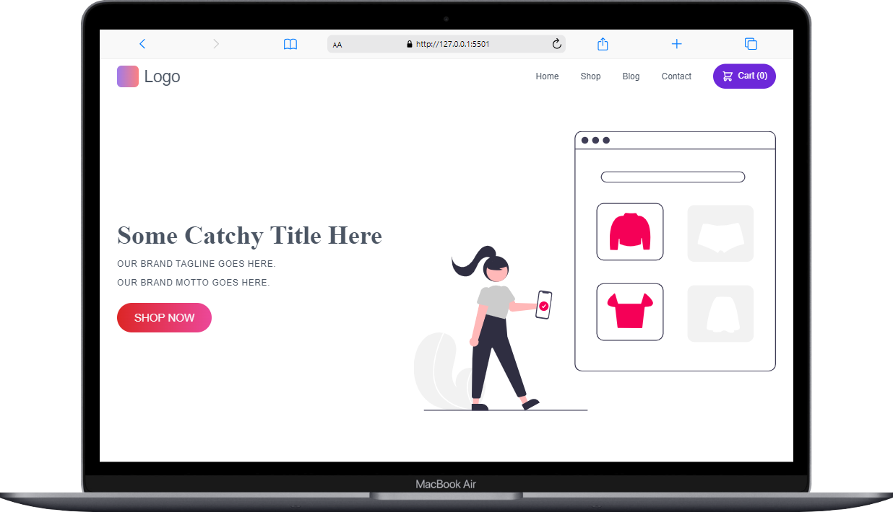

# Eshop Website Design with HTML and CSS

This project showcases a design for an e-commerce website (eshop) using only HTML and CSS. The design is responsive and adapts to different screen sizes. Additionally, it includes a backend built with FastAPI for managing dynamic functionalities such as shopping cart management and other server-side operations.

## Preview

### Cover 1


### Cover 2, Cover 3 and 4
<table align="center">
  <tr>
    <td align="center">
      
    </td>
    <td align="center">
      
    </td>
    <td align="center">
      
    </td>
  </tr>
</table>

## Features

- **Responsive Design**: The layout adjusts for different screen sizes.
- **HTML & CSS**: Pure HTML and CSS without any frameworks.
- **Gradient Background**: Eye-catching gradient background for the subscription section.
- **Email Subscription Form**: Functional and styled email subscription form.

## Usage

1. Clone the repository:

    ```bash
    git clone https://github.com/Christmp19/eshop-website-design.git
    cd eshop-website-design
    ```

2. Open `index.html` in your browser to view the website.

## Backend Integration

### Overview

The backend for this project is built with FastAPI and serves as the backend API for managing the shopping cart and other dynamic functionalities.

### Prerequisites

Ensure you have Python 3.8 or later installed.

### Installation

1. **Clone the repository:**

    ```bash
    git clone https://github.com/Christmp19/eshop-website-design.git
    cd eshop-website-design
    ```

2. **Install backend dependencies:**

    Create and activate a virtual environment:

    ```bash
    python -m venv venv
    source venv/bin/activate  # On Windows use `venv\Scripts\activate`
    ```

    Install the dependencies from `requirements.txt`:

    ```bash
    pip install -r requirements.txt
    ```

### Running the Backend

1. **Start the FastAPI server:**

    ```bash
    uvicorn backend.main:app --reload
    ```

    The server will run on `http://127.0.0.1:8000`.

2. **Navigate to the API documentation:**

    Open your browser and go to `http://127.0.0.1:8000/docs` to access the FastAPI interactive documentation.

### Integrating Frontend with Backend

Ensure that the frontend application makes API requests to the correct backend endpoints. Update the API URLs in your frontend code as needed.
